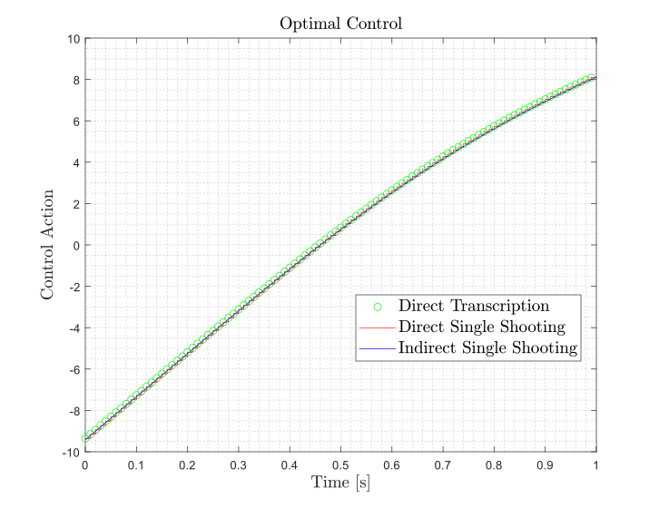
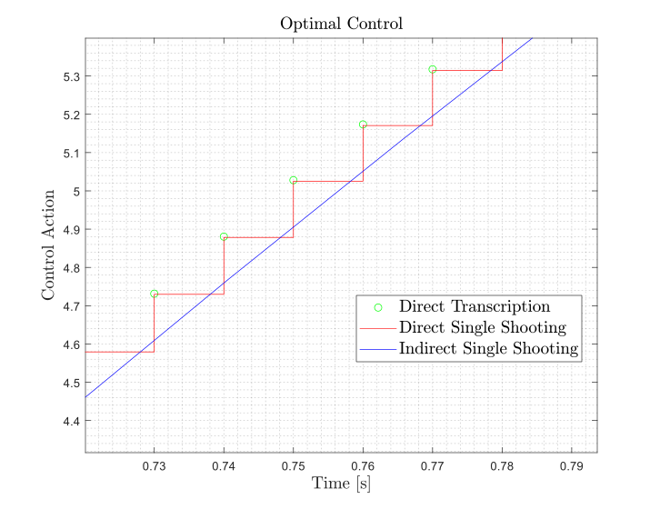
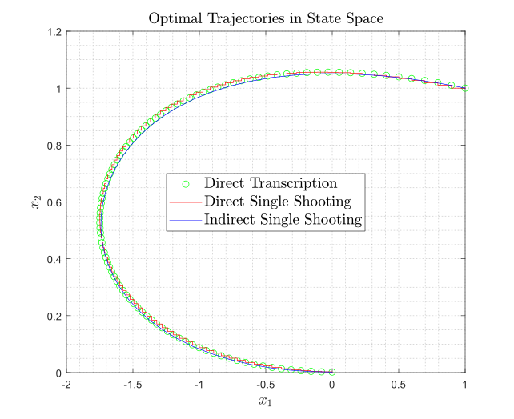

Matlab implementation of numerical methods for Optimal Control

Comparison and implementation of direct transcription, indirect single shooting and single shooting numerical methods for OC.
In the example below the Van Der Pol dynamics is considered:

Optimal Control History:

Optimal Trajectory:

